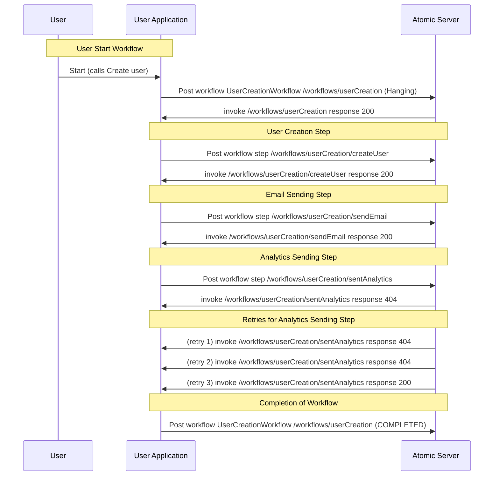

# Atomic 
### "A Workflow Orchestration Tool"

This simple yet powerful tool is designed for full-stack developers to effortlessly orchestrate complex workflows using exposed HTTP endpoints. It provides seamless and straightforward capabilities for executing workflows in either sequential or parallel order. The tool automates retries and failure handling, making it easier to coordinate tasks and automate processes, all in pure TypeScript code, without any external libraries.

## Key Features

- Exposed HTTP endpoints for initiating and executing workflows
- Automated retries and robust failure handling to ensure workflow completion
- Workflow execution in sequential or parallel order, as per the requirements
- Idempotent operation using unique keys to prevent duplicate execution
- Seamless integration with your existing database, email client, and analytics tools

# How to works

### Step 1: Define Your Endpoints

Start by defining the HTTP endpoints which will handle the various steps of your workflow. For instance, you might have one endpoint for creating a user, another for sending a user creation email, and another for sending analytics data.

### Step 2: Implement Your Endpoint Functions

Each endpoint needs to be implemented with a corresponding function. For example, a user creation endpoint could be implemented with a `createUserDBStep` function, an email endpoint with `createUserEmailStep`, and an analytics endpoint with `createUserAnalyticsStep`.

### Step 3: Create Your Workflow

Define your workflow that ties together all of your endpoints. For example, you might create a `createUserWorkflow` that first calls the user creation endpoint, then the email endpoint, and finally the analytics endpoint.

### Step 4: Make Your Endpoints Idempotent

To ensure reliability and consistency, make sure each endpoint in your workflow is idempotent. This means that if the endpoint is called multiple times with the same idempotency key, it will have the same effect as if it was called once. You can do this by tracking the idempotency key for each request and checking it before processing.

### Step 5: Trigger Your Workflow

Finally, you can trigger your workflow by exposing the HTTP endpoint that initiates the workflow, passing in any necessary parameters. For example, you might trigger a user creation workflow by exposing the `createUserEndpoint` function, passing in a unique idempotency key and user details.

At this point, the orchestration tool will take over. It will call the exposed workflow endpoint and, in case of any failure at any step, it will retry that step again until it succeeds, according to the predefined retry configuration. You can monitor the execution of your workflows and the status of each step from the tool's dashboard, ensuring complete visibility and control over your orchestrated workflows.

## Code Snippets Explanation


```typescript


// Retry configuration used for workflow steps
const retryConfig = { count: 10, backOff: 1000 };

// Base part of the workflow URLs
const workflowUrlBase = "/workflows/userCreation/steps";

// Your application API endpoint which creates a user
async function createUserEndpoint(idempotencyKey: guid, userName: string, email: string) {
    const payload = {userName, email};
    // Triggers workflow and handles retries and timeouts
    const userCreatedResponse = await postWorkflow("createUser", "/workflows/userCreation/index", idempotencyKey, payload, {timeout: 8000});

    return {
        status: 200,
        userId: userCreatedResponse.id
    }
}

/*

        The following URLs will be invoked via Atomic!

 */

// User creation workflow, triggered at POST /workflows/userCreation
async function createUserWorkflow({idempotencyKey: guid, payload: any}) {
    const userCreatedResponse = await performWorkflowStep("createUser", idempotencyKey, payload);
    
    await Promise.all([
        await performWorkflowStep("sendEmail", idempotencyKey, userCreatedResponse.response),
        await performWorkflowStep("sendAnalytics", idempotencyKey, userCreatedResponse.response)  
    ]);
}

// Creates a user in the database, triggered at POST /workflows/userCreation/steps/createUser
async function createUserDBStep({idempotencyKey: guid, payload: any}) {
    await db.saveUserToDB(idempotencyKey, payload);
}

// Sends a user creation email, triggered at POST /workflows/userCreation/steps/sendEmail
async function createUserEmailStep({idempotencyKey: guid, payload: any}) {
    await emailClient.sendEmail(idempotencyKey, payload);
}

// Sends analytics data for user creation, triggered at POST /workflows/userCreation/steps/sendAnalytics
async function createUserAnalyticsStep({idempotencyKey: guid, payload: any}) {
    await analytics.userCreated(idempotencyKey, payload);
}

/*

    Helper functions:

 */


// Helper function to POST requests to the atomic workflow server
async function postWorkflow(workflowName: string, stepInvokeUrl: string, idempotencyKey: guid, payload: any, options: any = {}) {
    return await httpClient.post(`${atomicBaseUrl}/${clientId}`, {
        workflowName,
        stepInvokeUrl: `${myBaseUrl}${stepInvokeUrl}`,
        idempotencyKey,
        payload,
        ...options,
    });
}

// Helper function to perform a workflow step
async function performWorkflowStep(stepName: string, idempotencyKey: guid, payload: any) {
    return await postWorkflow("createUser", `${workflowUrlBase}/${stepName}`, idempotencyKey, payload, {retry: retryConfig});
}

```



